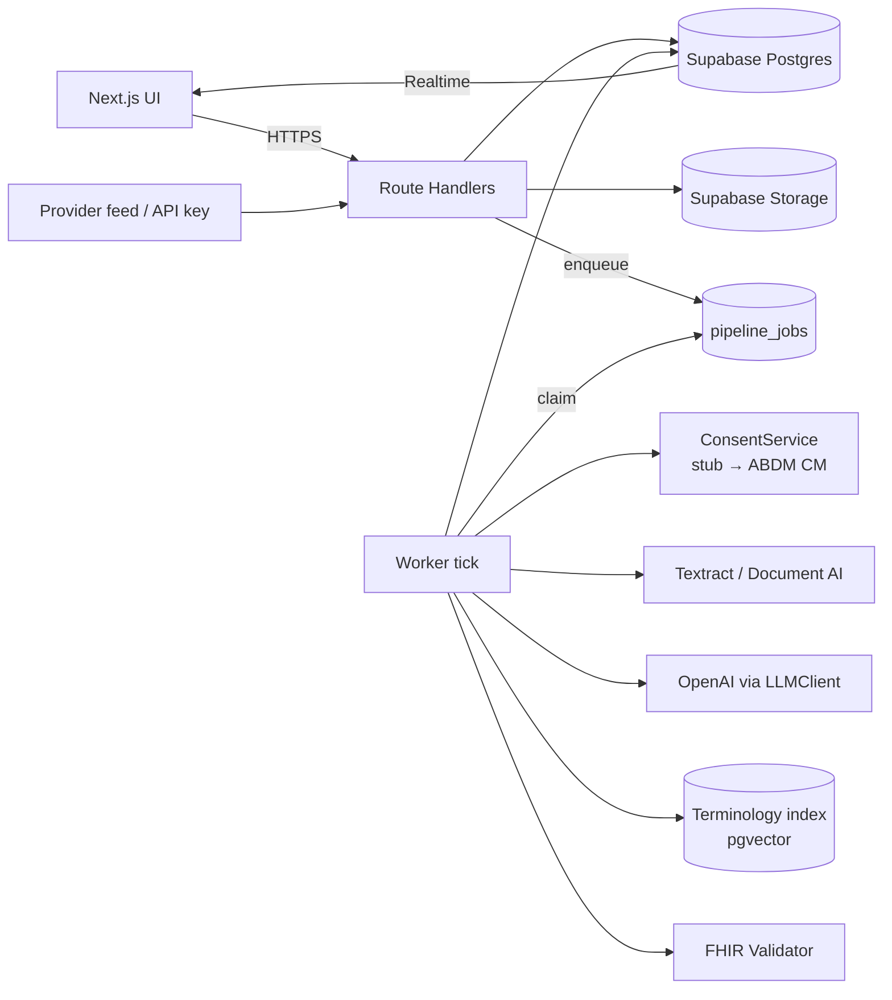
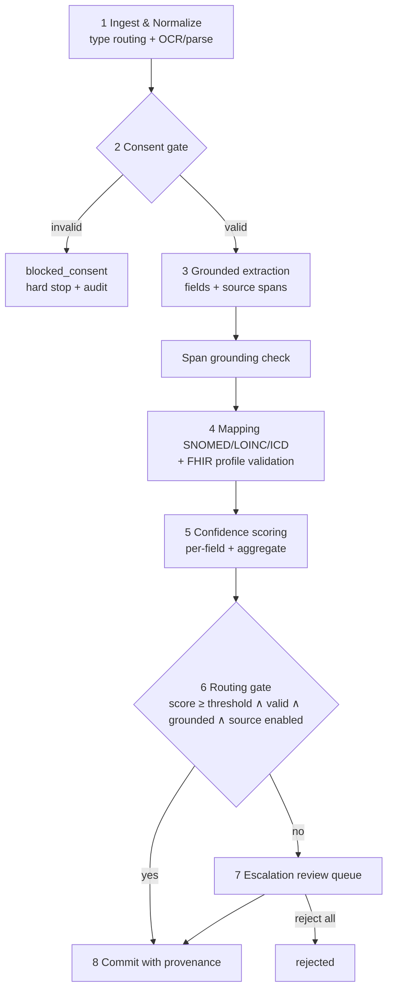
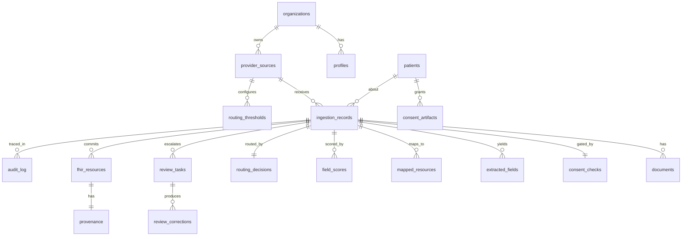

# Engineering Document (High-Level Design)
## Agentic Health Record Ingestion — "Trust at the Edge"

| | |
|---|---|
| Source PRD | `docs/Agentic Health Record Ingestion_PRD.docx` |
| Status | Draft for approval (Stage 1) |
| Stack (fixed) | Next.js 14 App Router · Supabase (Postgres/Auth/Storage) · Netlify · OpenAI (or Azure OpenAI) · AWS Textract / Google Document AI |
| Authoritative? | Yes. No implementation begins until this document is approved. |

---

## 1. Executive Summary

**Project name:** Agentic Health Record Ingestion (working name: *Trust at the Edge*)

**Business goal:** Cut the cost per integration of onboarding a new provider's unstructured health data feed by converting scans, faxes, non-standard HL7v2 and free-text notes into consent-scoped, standards-coded, schema-valid FHIR R4 resources, automatically where the system is confident and via human review where it is not.

**Problem statement:** Manual coding does not scale; rule/template NLP breaks silently on new layouts and cannot express confidence. Platforms either over-trust automation (patient-safety risk) or under-trust it (cost never falls). The system must close the *confidence gap at the point of ingestion*.

**Target users:**
- Primary buyer/persona: Integration/Platform teams at health data platforms (India ABDM/ABHA: HIPs, HIUs, PHR apps; secondary: US HIPAA/TEFCA).
- Focus user: Data Ops / Health Information Reviewers (escalation-queue reviewers).
- Supporting: Compliance officers, product managers.

**Success criteria (from PRD):**

| Metric | Type | Target |
|---|---|---|
| Cost per successfully ingested record at ≥99% clinical field accuracy | North Star | Falls release over release; GA gated on it |
| Straight-through-processing (STP) rate | Primary | >50% Beta, >80% GA |
| Field accuracy on auto-committed records | Primary | ≥99% |
| Time-to-trust per new provider source | Primary | Tracked (days from feed connected to STP stable above threshold) |
| Escalation precision | Secondary | >70% (alert <60%) |
| Mean review time per escalated record | Secondary | Falling week over week |
| Audit completeness | Secondary | 100% records have a reconstructable trail |
| Downstream clinically significant error rate | Safety backstop | 0% |
| Mapping exact-code match | Eval | >95% |
| Confidence calibration error | Eval | <5% |
| End-to-end latency per record | NFR | <2 min (async) |
| Pipeline failure rate | NFR | <1% |

**Key design principles**
1. *Consent before computation:* no PHI is processed before consent passes.
2. *Grounded or absent:* a field without a source span is never proposed; it is "not found".
3. *Deterministic where possible:* only extraction, mapping and self-assessment use an LLM. Gates, validation, routing, commit are deterministic code.
4. *Every decision is explainable and immutable:* a reasoning trace and audit entry exist for every record, auto-committed or escalated.
5. *Fail closed:* anything invalid, uncertain or errored escalates; nothing ambiguous auto-commits.

---

## 2. Product Scope

### 2.1 In scope (MVP, Weeks 1–4)
| ID | Capability | PRD ref |
|---|---|---|
| F1 | Multi-format ingestion (PDF/scan/fax image, HL7v2, text note) tagged with source provider + patient ABHA/MRN | FR1 / US-001 |
| F2 | Consent gate (ABDM, **stubbed ledger** in MVP) | FR2 / US-002 |
| F3 | Grounded extraction with mandatory source spans | FR3 / US-003 |
| F4 | FHIR R4 mapping (SNOMED CT / LOINC / ICD) + profile validation | FR4, FR5 / US-004 |
| F5 | Per-field + aggregate confidence scoring | FR6 / US-005 |
| F6 | Threshold routing (fixed conservative threshold; schema supports per-source/per-resource) | FR7 / US-006 |
| F7 | Escalation review UI (per-field accept/correct/reject) | FR8 / US-007 |
| F8 | Commit to FHIR store with provenance + immutable audit log | FR9 / US-008 |
| Constraint | Discharge summaries only; ABDM only; one synthetic provider source | PRD roadmap |

### 2.2 Out of scope for MVP
Calibration automation, per-source dashboard, lab reports, real ABDM sandbox, HIPAA path, fine-tuning, handwriting/non-English reliability (these escalate), clinical decision support, patient-facing UI, EHR write-back/outbound FHIR API to third parties.

### 2.3 Future enhancements
| Release | Items |
|---|---|
| MVP 1 (Wk 5–6) | Lab reports (US-011); real ABDM Consent Manager sandbox; hardened review queue |
| GA (Wk 7–10) | Calibration loop (US-009, FR10); per-source dashboard (US-010, FR11); gold-standard benchmark; go/no-go on north star |
| Iteration | HIPAA authorization path (US-012); more doc types/sources; per-resource-type thresholds (stricter MedicationRequest/AllergyIntolerance); automated regression suite per new source; fine-tuning / in-country model if triggers hit (≥5,000 clean corrections, accuracy plateau, or residency decision) |

### 2.4 Gaps in the PRD (flagged, not invented)
- Cost, pricing, market size, revenue sections are empty templates → no cost model in this doc beyond per-record cost *tracking* (see §8.8).
- "Launch %" exposure (1–2%, 2–10%) is defined as share of records bypassing full manual review; implemented as the `auto_commit_enabled` + holdback controls per source (§7, §8.7).
- Actual ABDM consent artifact schema/HIU-HIP APIs must be confirmed with legal/ABDM docs before MVP1 (stub contract defined in §9.7).
- Data residency vendor/region choice for the LLM (OpenAI direct vs Azure OpenAI in an India region) and OCR is a hard requirement but unresolved (see Appendix A).

---

## 3. User Personas

| Persona | Role key | Responsibilities | Permissions | Primary workflows |
|---|---|---|---|---|
| **Integration Engineer** | `integration_engineer` | Onboard provider sources, submit raw feeds, configure thresholds | CRUD sources; upload/submit records; view own-org records, pipeline status; edit thresholds (changes audited); cannot review or edit committed data | Create source → connect feed → upload sample → watch pipeline → tune threshold |
| **Data Ops Reviewer** | `reviewer` | Resolve escalated records field by field | View/claim review tasks; accept/correct/reject fields; view source docs; cannot change thresholds or consent | Open queue → claim task → compare source/draft/trace → submit review |
| **Compliance Officer / Admin** | `admin` | Consent policy, audit, safety controls, user management | All read; manage users/roles; pause/resume source auto-commit; switch source to full manual review; audit search/export; set thresholds | Audit lookup per record → pause source on incident → review consent blocks |
| **Product Manager** | `viewer` | Track north-star and per-source metrics | Read-only dashboard and aggregate metrics; no PHI field values | Open dashboard → compare sources → decide investment |

Permissions are enforced twice: API middleware (role check) and Postgres RLS (§7.3).

---

## 4. User Flows

Format: **User Action → Frontend → Backend → Database → System Response**.

### 4.1 Sign-in
1. User enters email + password (or magic link) → `/login` form validates with Zod → `POST` Supabase Auth → `profiles` row lookup for role + org → `audit_log` entry `auth.login` → redirect by role (reviewer→`/review`, integration→`/ingest`, admin→`/audit`, viewer→`/dashboard`). Errors: generic "Invalid credentials" (no user enumeration); lockout after 5 failures/15 min.

### 4.2 Source onboarding (US-001)
Integration Engineer clicks *New source* → `/sources/new` form (name, size class, region, language, doc types) → `POST /api/sources` → validate, role check → insert `provider_sources` (`auto_commit_enabled=false`), seed `routing_thresholds` default (0.97 all resource types) → audit `source.created` → source appears with status "Shadow (manual review only)". Auto-commit is enabled only after labeled-sample eval passes (PRD staged-exposure rule).

### 4.3 Record submission (US-001)
Action: drag-and-drop file or paste HL7v2/note text, select source, enter patient identifier (ABHA or MRN) and data category.
→ Frontend validates type (PDF/PNG/JPG/TIFF/HL7/TXT), size ≤25 MB, shows upload progress
→ `POST /api/ingestions` (multipart) – authenticate, authorize, validate, compute SHA-256 for dedupe, upload to Supabase Storage (private bucket, region-pinned), insert `ingestion_records(status='received')`, enqueue job `consent_gate`
→ DB: `ingestion_records`, `documents`, `pipeline_jobs`, `audit_log (ingest.received)`
→ Response `202 {record_id, status:'received'}`; UI row appears with live status (Supabase Realtime subscription on `ingestion_records`).
Feed mode (non-UI): `POST /api/ingestions` with API key per source (same contract, JSON/base64 or signed upload URL).

### 4.4 Pipeline execution (core, async)
```
received → consent_check → normalizing → extracting → mapping → validating → scoring → routing → (auto_committed | needs_review → review_complete → committed | rejected) 
                 └─ blocked_consent (terminal, hard stop)
            any stage error → retry once → needs_review (or failed if unrecoverable, alert)
```
Per stage: worker claims job (`SELECT … FOR UPDATE SKIP LOCKED`) → performs stage → writes artifacts → writes `audit_log` stage event → enqueues next job → `ingestion_records.status` updated → Realtime pushes to UI.

### 4.5 Consent block (US-002, FR2)
Job `consent_gate` → `ConsentService.verify(patientId, sourceId, dataCategories)` → insert `consent_checks` (result, artifact id, matched scope) → if `missing | expired | revoked | out_of_scope`: status `blocked_consent`, **no document bytes are sent to OCR or LLM**, audit `consent.blocked`, admin notified (in-app) → UI shows red "Blocked: <reason>" with consent artifact reference. No retry; a new submission is required after consent is fixed.

### 4.6 Auto-commit path (US-003→US-008)
Normalize (OCR/parse) → extract fields with spans → map & validate → score → route: `aggregate ≥ threshold(source, resourceType)` AND all validations pass AND all committed fields grounded AND source `auto_commit_enabled` AND not selected for shadow-review holdback → single DB transaction inserts `fhir_resources` (+ `provenance`), updates status `auto_committed`, writes `routing_decisions` and `audit_log`. UI: record detail shows "AI-extracted · auto-committed" with confidence, trace, consent reference.

### 4.7 Escalation review (US-007, FR8)
Routing sends record to review: creates `review_tasks` (priority = lowest field confidence × resource risk weight, oldest-first tiebreak) →
Reviewer opens `/review` queue → claims task (`POST /api/review-tasks/:id/claim`, 30-min lock) →
`/review/[taskId]` shows three panes: source document viewer (page image with span highlight), draft FHIR/fields table (value, code, per-field confidence, stated/inferred flag), reasoning trace →
Reviewer clicks a field: accept / correct (edit value and/or pick a different code from candidates) / reject (mark "not found") →
`POST /api/review-tasks/:id/submit` → server re-validates the corrected resource against the FHIR profile (must pass) → inserts `review_corrections` per changed field (original, corrected, span, source) → resource committed with `provenance.reviewer` → `audit_log review.submitted` → task closed → next task auto-loads.
A reviewer may *release* a task (unlocks) or *flag source as consistently poor*.

### 4.8 Audit lookup (US-008, FR9)
Admin searches by record id / patient identifier / source / date → `GET /api/audit?...` → returns ordered event chain (consent result, OCR confidence, extraction, mapping, validation, score, threshold applied, decision + reasoning, reviewer + diff) → UI timeline with export (JSON/CSV). Audit rows are append-only; no update/delete exists in the API or DB (trigger blocks).

### 4.9 Calibration loop (US-009, FR10 — GA)
Weekly job: reads `review_corrections` + holdback outcomes → computes per-source/resource reliability buckets → proposes new threshold (stored as `threshold_proposals`) → Admin approves → `routing_thresholds` new version → audit `threshold.changed`. Never auto-applies in v1.

### 4.10 Per-source dashboard (US-010, FR11 — GA)
Viewer opens `/dashboard` → `GET /api/metrics/sources` → reads `source_metrics_daily` (materialized nightly + on-demand) → shows STP, queue depth, accuracy vs gold set, escalation precision, mean review time, cost/record, segmented by provider size/language/doc type. Alerts card shows breached thresholds.

### 4.11 Admin safety actions
Admin clicks *Pause auto-commit* on a source (or confirmed downstream error report triggers it) → `POST /api/sources/:id/pause` → sets `auto_commit_enabled=false`, `pause_reason`, all new records route to review → audit `source.paused` → banner on source. *Resume* requires a note and passing eval status.

### 4.12 Downstream error report
Clinician-facing system or admin submits `POST /api/records/:id/error-report` → insert `downstream_errors`, auto-pause source, create mandatory pipeline-review task, notify admin.

---

## 5. Frontend Architecture

### 5.1 Stack
| Concern | Choice |
|---|---|
| Framework | Next.js 14, App Router, TypeScript strict |
| UI | Tailwind CSS + shadcn/ui (Radix); tokens from `docs/design.md` via the `/design-system` skill (all color/spacing/type from the design system) |
| Server state | TanStack Query v5 (+ Supabase Realtime for record status and queue) |
| Client state | Zustand (review workspace draft, viewer zoom/selected span only) |
| Forms | React Hook Form + Zod (schemas shared with API) |
| Routing | App Router; route groups `(auth)` and `(app)`; role-based `middleware.ts` guard; server components for read-heavy pages, client components for review workspace |
| Doc viewer | `react-pdf` (pdf.js) + image canvas with bounding-box span overlay |
| Charts | Recharts (per `dataviz` conventions) |
| Tables | TanStack Table |

### 5.2 Pages
| Route | Role access | Purpose |
|---|---|---|
| `/login` | public | Sign in |
| `/ingest` | integration_engineer, admin | Submit records, recent submissions with live status |
| `/records` and `/records/[id]` | all (viewer: metadata only) | Record list; detail with status timeline, fields, FHIR JSON, trace, provenance |
| `/review` | reviewer, admin | Escalation queue (filters: source, resource, priority, age) |
| `/review/[taskId]` | reviewer | Side-by-side review workspace |
| `/sources`, `/sources/[id]` | integration_engineer, admin | Source CRUD, thresholds, auto-commit toggle, API key |
| `/dashboard` | all | STP/accuracy/queue per source (GA) |
| `/audit` | admin | Audit search + timeline + export |
| `/admin/users` | admin | Manage users and roles |
| `/settings/thresholds` | admin, integration_engineer | Threshold matrix source × resource type |

### 5.3 Component hierarchy
```
app/layout (providers: Query, Theme, Toaster)
├─ (auth)/login → LoginForm
└─ (app)/layout → AppShell(Sidebar, Topbar, RoleGuard)
   ├─ ingest → UploadDropzone, Hl7TextInput, SourceSelect, PatientIdField, RecentSubmissionsTable → StatusBadge
   ├─ records → RecordsTable(filters) ; [id] → RecordHeader, PipelineTimeline, FieldsTable, FhirJsonViewer, ReasoningTrace, ProvenanceCard
   ├─ review → QueueTable(PriorityChip, AgeChip) ; [taskId] → ReviewWorkspace
   │    ├─ SourceViewer(PageNav, ZoomControls, SpanHighlight)
   │    ├─ DraftFieldList → FieldRow(ConfidenceBar, StatedInferredTag, CitationLink, AcceptCorrectRejectButtons, CodePicker)
   │    └─ TracePanel, SubmitBar
   ├─ sources → SourceForm, ThresholdMatrix, AutoCommitToggle(ConfirmDialog)
   ├─ dashboard → KpiTiles, StpTrendChart, CalibrationChart, SourceTable, AlertList
   └─ audit → AuditSearch, AuditTimeline, ExportButton
```

### 5.4 UX states (required on every data view)
| State | Behavior |
|---|---|
| Loading | Skeletons matching final layout; no layout shift; review workspace blocks edit until source image loaded |
| Empty | Contextual message + primary action (e.g. "No escalations. Queue clear.") |
| Error | Inline error with request id, retry; 403 → "Not permitted"; never raw stack traces |
| Realtime | Status badge animates stage transitions; reconnect banner on Realtime drop with polling fallback (10 s) |
| Conflict | Task claimed by another reviewer → read-only banner |
| Responsive | Desktop-first (≥1280 for review workspace); dashboard/records usable at ≥768; review workspace below 1024 stacks panes in tabs |
| Accessibility | WCAG 2.1 AA: keyboard operable review (J/K next field, A accept, C correct, R reject), focus rings, aria-live for status changes, confidence not conveyed by color alone (label + icon), contrast per design tokens |
| Safety UX | Auto-committed values always display "AI-extracted" tag, confidence, source link; destructive/safety actions (pause, resume, threshold change) need confirm dialog + reason |

---

## 6. Backend Architecture

### 6.1 Stack
| Layer | Choice |
|---|---|
| API | Next.js Route Handlers (`app/api/**`), Node runtime, Zod validation |
| DB/Auth/Storage | Supabase Postgres, Supabase Auth, Supabase Storage (private bucket, in-region project) |
| Queue | Postgres-backed job table (`pipeline_jobs`) with `FOR UPDATE SKIP LOCKED`; claimed by worker route handlers |
| Worker trigger | Netlify Scheduled + Background Functions (15-min limit) invoke `/api/worker/tick`; pg_cron (Supabase) fallback. One job = one stage, each < 60 s, so serverless limits are respected. **If sustained volume exceeds this, move worker to a long-running container (see Appendix A).** |
| OCR | AWS Textract (ap-south-1) or Google Document AI (asia-south1): per-page OCR + confidence; floor 80% |
| LLM | OpenAI models (vision + text, strict JSON-schema structured outputs) via the OpenAI API, or Azure OpenAI in an India region when in-region processing is required (subject to residency decision), behind the `LLMClient` interface |
| Terminology | pgvector in Supabase + lexical index over SNOMED CT / LOINC / ICD-10 (licensed content loaded at setup) |
| FHIR validation | HL7 FHIR Validator (Java, run as containerised validation service called from a worker) **or** `fhir-validator` Node lib with R4 profiles + ABDM IGs; interface `FhirValidator` hides choice (Appendix A) |
| Observability | Structured JSON logs (pino), Sentry, metrics table + dashboards |

### 6.2 Core systems
| System | Responsibility |
|---|---|
| Auth & authz | Supabase JWT; `withAuth(roles[])` wrapper; org scoping; RLS as second line |
| Business logic | Pipeline stage services (`src/server/pipeline/*`), pure and unit-testable; LLM calls only inside `extraction`, `mapping`, `scoring` |
| Validation | Zod at every API boundary and **on every LLM output**; invalid JSON → retry once → escalate |
| Middleware | request id, auth, rate limit (per user/API key), body size limit, audit-context injection |
| Error handling | Typed `AppError(code, httpStatus, retryable)`; uniform error envelope (§9.1); stage errors never lose a record, they escalate |
| Idempotency | `Idempotency-Key` header on submissions; SHA-256 document dedupe per source |
| Config | Thresholds, OCR floor, retry counts, holdback % read from DB/config, never hard-coded |

### 6.3 Service interaction diagram


### 6.4 Pipeline detail (the 8 PRD components → code)


Stage contracts:
| Stage | Input | Output | Deterministic? | Failure behavior |
|---|---|---|---|---|
| normalize | document bytes / HL7 / text | `normalized_text` per page, OCR confidence, page images | Routing yes; OCR ML | OCR conf <80% → `needs_review` with reason `low_ocr_quality` (request re-upload), no extraction |
| consent_check | patient id, source, categories | `consent_checks` row | Yes | `blocked_consent` |
| extract | text + page images | `extracted_fields[]` | LLM | invalid/ungrounded → drop field to "not found"; schema fail → retry once → escalate |
| map | extracted fields | `mapped_resources[]` with codes | LLM + retrieval | no candidate ≥ min score → leave uncoded + escalate |
| validate | FHIR resources | pass/fail with rule ids | Yes | any fail → escalate |
| score | fields, mapping, validation | per-field/aggregate scores, trace | Formula + LLM self-assess | missing → 0 (escalate) |
| route | scores, thresholds, flags | decision + trace | Yes | default escalate |
| commit | approved resources | `fhir_resources`, `provenance` | Yes (transaction) | rollback; retry; on repeat fail alert |

### 6.5 Security and compliance controls (architecture level)
- Consent hard gate precedes any OCR/LLM call; enforced in code (`assertConsent()` required parameter of downstream services) and tested adversarially.
- Encryption in transit (TLS 1.2+) and at rest (Supabase/AES-256); storage bucket private with short-lived signed URLs (≤5 min).
- PHI never in logs, URLs or analytics; log redaction middleware.
- Secrets only in Netlify/Supabase env (never `NEXT_PUBLIC_` for secrets); service-role key used only server-side.
- Data residency: Supabase project, storage, OCR and LLM endpoints all in-region (India); no training on customer data by vendors (zero-retention terms).
- Immutable `audit_log` with DB trigger rejecting UPDATE/DELETE and hash-chain (`prev_hash`, `hash`) for tamper evidence.
- Rate limiting + abuse controls on submission and LLM spend budgets (§8.6). Detailed controls are scoped to Stage 7 (`/security-foundation`).

---

## 7. Database Design and Schema

PostgreSQL (Supabase). UUID PKs (`gen_random_uuid()`), `created_at timestamptz default now()`, `updated_at` where mutable. All tables have RLS enabled. Enum types shown inline.

### 7.1 Tables

**`organizations`** — tenant (the health data platform)
`id uuid PK`, `name text NOT NULL`, `region text NOT NULL default 'in'`. Unique `(name)`.

**`profiles`** — app user, 1:1 with `auth.users`
`id uuid PK FK→auth.users(id)`, `org_id uuid FK→organizations NOT NULL`, `full_name text`, `role role_t NOT NULL` (`integration_engineer|reviewer|admin|viewer`), `active bool default true`. Index `(org_id, role)`.

**`provider_sources`** — a hospital/lab/clinic feed
`id`, `org_id FK`, `name NOT NULL`, `provider_type text` (hospital/lab/clinic), `size_class text` (small/medium/large), `region text`, `primary_language text`, `doc_types text[]`, `consent_regime regime_t default 'abdm'`, `auto_commit_enabled bool default false`, `pause_reason text`, `eval_status text` (`none|passed|failed`), `eval_passed_at`, `api_key_hash text`, `holdback_pct numeric(5,2) default 10`, `created_by FK`. Unique `(org_id, name)`. Index `(org_id)`.

**`patients`** — minimal reference, no demographics beyond identifiers
`id`, `org_id FK`, `abha_number_enc bytea NULL` (encrypted), `abha_hash text` (HMAC for lookup), `mrn_enc bytea`, `mrn_hash text`, `source_id FK`. Unique `(org_id, abha_hash)`, `(source_id, mrn_hash)`. Constraint: at least one of abha/mrn hash non-null.

**`consent_artifacts`** — ledger mirror (stub in MVP, real in MVP1)
`id`, `patient_id FK`, `artifact_ref text NOT NULL` (ABDM consent id), `regime regime_t`, `categories text[] NOT NULL` (e.g. `DischargeSummary`, `Prescription`, `DiagnosticReport`), `valid_from`, `valid_to`, `status` (`granted|revoked|expired`), `hip_id text`, `raw jsonb`. Index `(patient_id, status, valid_to)`, unique `(regime, artifact_ref)`.

**`ingestion_records`** — one submission through the pipeline
`id`, `org_id FK`, `source_id FK NOT NULL`, `patient_id FK`, `doc_type doc_t` (`discharge_summary|lab_report|other`), `input_kind input_t` (`pdf|image|hl7v2|text`), `status record_status_t` (`received, consent_check, blocked_consent, normalizing, extracting, mapping, validating, scoring, routing, needs_review, in_review, auto_committed, committed, rejected, failed`), `status_reason text`, `content_sha256 text NOT NULL`, `idempotency_key text`, `submitted_by uuid FK profiles NULL` (null if API key), `holdback bool default false`, `cost_usd numeric(10,4) default 0`, `latency_ms int`, `current_prompt_set_id FK`. Unique `(source_id, content_sha256)`, unique `(source_id, idempotency_key)` where not null. Indexes `(org_id, status, created_at desc)`, `(source_id, created_at desc)`.

**`documents`** — stored artifacts
`id`, `record_id FK`, `storage_path text NOT NULL`, `mime_type`, `bytes int`, `page_count int`, `ocr_engine text`, `ocr_confidence numeric(4,3)`, `normalized_text jsonb` (array of `{page, text, blocks:[{id,bbox,text,conf}]}`). Index `(record_id)`.

**`consent_checks`** — gate result per record
`id`, `record_id FK unique`, `result consent_result_t` (`valid|missing|expired|revoked|out_of_scope|error`), `artifact_id FK NULL`, `required_categories text[]`, `matched_scope text[]`, `regime`, `checked_at`, `detail jsonb`.

**`extracted_fields`** — LLM draft fields
`id`, `record_id FK`, `field_key text NOT NULL` (e.g. `diagnosis[0].text`, `medication[2].dose`), `resource_type text`, `value jsonb`, `found bool NOT NULL`, `source_page int`, `source_span jsonb` (`{block_ids, char_start, char_end, quote, bbox}`), `grounded bool NOT NULL` (verified by grounding check), `basis` (`stated|inferred`), `model_confidence numeric(4,3)`, `prompt_version_id FK`. CHECK: `found = false OR (source_span IS NOT NULL)`. Index `(record_id)`.

**`mapped_resources`** — candidate FHIR resources and codes
`id`, `record_id FK`, `resource_type text NOT NULL`, `resource jsonb NOT NULL`, `codings jsonb` (array `{field_key, system, code, display, match_confidence, candidates[]}`), `validation_status` (`pass|fail|pending`), `validation_issues jsonb`, `profile_url text`. Index `(record_id, resource_type)`.

**`field_scores`** — per-field and aggregate confidence
`id`, `record_id FK`, `scope` (`field|resource|record`), `field_key text NULL`, `resource_id FK NULL`, `extraction_conf`, `mapping_conf`, `validation_completeness`, `score numeric(4,3) NOT NULL`, `components jsonb`, `reasoning text`.

**`routing_thresholds`** — versioned policy
`id`, `source_id FK`, `resource_type text` (`'*'` = default), `threshold numeric(4,3) NOT NULL`, `version int NOT NULL`, `active bool`, `changed_by FK`, `reason text`. Unique `(source_id, resource_type, version)`. Default seed 0.97; stricter MedicationRequest/AllergyIntolerance 0.99.

**`routing_decisions`**
`id`, `record_id FK unique`, `aggregate_score`, `thresholds_applied jsonb`, `validation_result`, `decision` (`auto_commit|escalate`), `escalation_reasons text[]` (`below_threshold|schema_invalid|ungrounded|low_ocr|source_not_enabled|holdback|llm_error|ambiguous_label`), `reasoning_trace text NOT NULL`, `rule_version text`.

**`review_tasks`**
`id`, `record_id FK`, `status` (`open|claimed|completed|released`), `priority numeric`, `claimed_by FK NULL`, `claimed_at`, `lock_expires_at`, `completed_at`, `kind` (`escalation|holdback_audit|downstream_error_review`). Index `(status, priority desc, created_at)`.

**`review_corrections`** — labeled data for calibration
`id`, `task_id FK`, `record_id FK`, `field_key`, `action` (`accept|correct|reject`), `original_value jsonb`, `corrected_value jsonb`, `original_code jsonb`, `corrected_code jsonb`, `source_span jsonb`, `reviewer_id FK`, `source_id FK`, `reviewed_at`. Index `(source_id, reviewed_at)`.

**`fhir_resources`** — the committed store
`id uuid PK` (also FHIR logical id), `org_id`, `record_id FK`, `patient_id FK`, `resource_type text`, `resource jsonb NOT NULL`, `version_id int default 1`, `commit_mode` (`auto|human`), `ai_extracted bool default true`, `created_at`. Index `(patient_id, resource_type)`, GIN `(resource jsonb_path_ops)`. Immutable except new versions (history in `fhir_resource_versions`).

**`provenance`**
`id`, `fhir_resource_id FK`, `record_id`, `source_id`, `consent_artifact_id`, `extraction_method text`, `model_id text`, `prompt_version_id`, `reviewer_id NULL`, `field_provenance jsonb` (per element: span, confidence), `committed_at`.

**`audit_log`** — append-only, hash-chained
`id bigserial PK`, `org_id`, `record_id NULL`, `actor_type` (`user|system|api_key`), `actor_id`, `event text NOT NULL`, `payload jsonb NOT NULL`, `created_at`, `prev_hash text`, `hash text NOT NULL`. Trigger blocks UPDATE/DELETE/TRUNCATE. Indexes `(record_id, id)`, `(org_id, created_at)`, `(event)`.

**`pipeline_jobs`** — queue
`id`, `record_id FK`, `stage text`, `status` (`queued|running|done|failed|dead`), `attempts int default 0`, `max_attempts int default 2`, `run_at timestamptz`, `locked_at`, `locked_by`, `last_error text`. Index `(status, run_at)`.

**`prompt_versions`**
`id`, `component` (`extraction|mapping|scoring|routing_explain`), `version text`, `template text`, `few_shot jsonb`, `model_id`, `eval_run_id FK NULL`, `active bool`, `created_by`. Unique `(component, version)`.

**`terminology_concepts`** — RAG store
`id`, `system` (`snomed|loinc|icd10`), `code text`, `display text`, `synonyms text[]`, `embedding vector(1024)`, `resource_types text[]`. Unique `(system, code)`, HNSW index on `embedding`, GIN on `to_tsvector(display)`.

**`eval_samples`** and **`eval_runs`** — ground truth and results
`eval_samples`: `id`, `source_label`, `doc_type`, `origin` (`clinician|synthetic|public|production_correction`), `storage_path`, `expected jsonb`, `agreement numeric`, `ambiguous bool`, `split` (`dev|heldout`). `eval_runs`: `id`, `kind`, `prompt_set jsonb`, `metrics jsonb` (f1, mapping match, calibration error), `passed bool`, `ran_at`.

**`source_metrics_daily`** — dashboard aggregates
`source_id`, `day`, `records`, `stp_count`, `escalated`, `review_changed`, `escalation_precision`, `mean_review_s`, `accuracy_gold`, `cost_usd`, `downstream_errors`, `segment jsonb`. PK `(source_id, day)`.

**`downstream_errors`**
`id`, `record_id`, `fhir_resource_id`, `reported_by`, `description`, `severity`, `status`, `source_paused bool`.

**`threshold_proposals`** (GA) — `id`, `source_id`, `resource_type`, `current`, `proposed`, `evidence jsonb`, `status`, `decided_by`.

### 7.2 Relationships


### 7.3 RLS policy summary
| Table | Policy |
|---|---|
| All org-scoped | `org_id = (select org_id from profiles where id = auth.uid())` |
| `fhir_resources`, `extracted_fields`, `documents`, `review_*` | role in (`integration_engineer`,`reviewer`,`admin`); `viewer` has **no** access to PHI tables |
| `provider_sources`, `routing_thresholds` | read all roles; write `integration_engineer`,`admin` |
| `review_corrections` | insert/read `reviewer`,`admin` |
| `audit_log` | select `admin` (and own events for others); insert only via `SECURITY DEFINER` function; no update/delete |
| `source_metrics_daily` | select all roles (aggregates only) |
| Worker | Uses service-role key server-side only |

### 7.4 Constraints worth enforcing in the DB
- `extracted_fields`: `found ⇒ source_span NOT NULL` (grounding at the data layer).
- `fhir_resources` insert allowed only if matching `routing_decisions.decision='auto_commit'` or a completed `review_task` (enforced by function `commit_record()`).
- `consent_checks.result='valid'` required for any record to progress beyond `consent_check` (checked in `commit_record()` too: defence in depth).

---

## 8. AI Architecture

### 8.1 Model strategy
| Aspect | Decision |
|---|---|
| Provider | OpenAI (hosted, closed-source), or Azure OpenAI for in-region processing, accessed through the `LLMClient` interface (`complete({system, messages, schema, images})`) so the provider can be swapped |
| Model tier | Frontier multimodal model for extraction/mapping/self-assessment; configurable per component via `prompt_versions.model_id` (cheaper tier for routing explanation) |
| Context | Entire document in one call (PRD: 128K+); multi-page scans passed as page images + OCR text so spans stay consistent across pages |
| Fine-tuning | None at MVP; triggers per PRD (≥5,000 clean corrections, plateau, residency) |
| Residency | In-region endpoint, zero data retention, no vendor training on inputs |
| Latency target | <2 min/record end-to-end (async) |

### 8.2 Agent design (steps as constrained tool calls)
The "agent" is an orchestrated pipeline where each LLM step is a bounded tool call with its own validation, not a free-roaming loop.

| Step | Technique (PRD) | Output schema | Guardrails |
|---|---|---|---|
| Extraction | Few-shot + fixed JSON schema; verbatim span mandatory; "not found" allowed | `{field, value, source_span, confidence, basis}` | Span must literally occur in OCR text (grounding check); else field dropped to not-found; temperature 0 |
| Mapping | Retrieval-grounded: top-k candidates from `terminology_concepts` (hybrid vector + lexical), model must **choose from candidates** or return `none` | `{field, code_system, code, display, match_confidence}` | Chosen code must exist in candidates and in terminology table; invalid → uncoded + escalate |
| Scoring | Structured self-assessment: "stated vs inferred" + score | per-field `{basis, score, rationale}` | Combined with deterministic components (§8.4) |
| Routing explanation | Chain-of-thought summary produced **after** deterministic decision | `{record_id, aggregate_confidence, validation_result, decision, reasoning_trace}` | Decision is computed by code; the LLM only narrates; trace stored, not shown as authoritative |

### 8.3 Grounding check (anti-hallucination, deterministic)
For each extracted field: normalize whitespace/case; verify `quote` is a substring of the cited page/blocks (fuzzy ≥0.95 for OCR noise); verify the field value is derivable from the quote (numeric/date values must appear in the quote after normalization; dose/unit exact). Failures → `grounded=false` → field cannot auto-commit; display as "not found" or flagged. 100% of committed fields must carry a valid span (PRD).

### 8.4 Confidence scoring
Per-field score = weighted combination:
`score = w_e·extraction_conf + w_m·mapping_conf + w_v·validation_completeness`, then caps:
- `basis = inferred` → cap at 0.80 (never auto-commits at conservative threshold)
- ungrounded → 0
- OCR block confidence below floor on the cited span → cap 0.75
Aggregate for a resource = **min** over required fields blended with mean (`0.7·min + 0.3·mean`) so one weak safety-critical field dominates. Record aggregate = min over resources. MVP weights are fixed constants (`w_e=0.5, w_m=0.3, w_v=0.2`) in config; calibration (GA) maps raw score to calibrated probability via isotonic regression per source×resource bucket, minimum 50 labeled samples before use.

### 8.5 Routing rule (deterministic)
```
auto_commit iff
   consent.valid
 ∧ ocr_conf ≥ floor(0.80)
 ∧ all validations pass (FHIR profile + required fields)
 ∧ all committed fields grounded
 ∧ for every resource r: score(r) ≥ threshold(source, resource_type(r))
 ∧ source.auto_commit_enabled
 ∧ ¬record.holdback
else escalate (reasons recorded)
```
Defaults: 0.97 general; 0.99 MedicationRequest, AllergyIntolerance, Observation-lab values. Thresholds are versioned and every decision stores the version and values applied.

### 8.6 Cost, token and rate controls
- Per-record token budget (input/output cap); oversized documents are chunked by page ranges with overlapping context, otherwise escalate.
- Per-org daily LLM spend cap and per-source concurrency limit (default 3 parallel records); breach → jobs delayed, alert admin.
- Prompt caching for the static system prompt + few-shots; page-image downscale to the minimum legible DPI; skip vision when OCR confidence ≥ 95% and layout is simple (flag per source) — GA optimization.
- `ingestion_records.cost_usd` accumulates OCR + LLM cost for the north-star metric.

### 8.7 Experimentation and safety mechanisms
- **Shadow-review holdback:** random `holdback_pct` (default 10%) of would-be auto-commits also create `holdback_audit` review tasks; measures the true error rate.
- **Threshold A/B in shadow mode:** decisions at candidate threshold are computed and logged (`routing_decisions.thresholds_applied.shadow`) without acting.
- **Staged exposure:** per-source `auto_commit_enabled` default false; enabled only after ≥50 labeled records pass eval (`eval_status='passed'`).
- **Auto-pause:** confirmed downstream error, or alerts (§13.5), set `auto_commit_enabled=false`.

### 8.8 Fallback and resilience
| Failure | Behavior |
|---|---|
| LLM timeout / 5xx / rate limit | Retry once with backoff; then `needs_review` (`llm_error`) |
| Invalid JSON/schema from model | Retry once with repair prompt; then escalate |
| OCR failure or <80% confidence | Escalate with reason `low_ocr_quality`, prompt re-upload / native digital file |
| Provider outage > N min | Circuit breaker opens; all new records queue; admin banner; optionally route all to manual |
| Regression after prompt/model change | One-click rollback of `prompt_versions.active`; pause auto-commit on affected sources |

### 8.9 Prompt management
Versioned library in `prompt_versions` (one active per component), each linked to the `eval_runs` that justified it; every change must pass held-out regression (F1, mapping match, calibration) before `active=true`; review trigger: reviewer correction rate >5% for a field/source over 30 days; recurring corrections become few-shot examples or knowledge-base entries.

### 8.10 Knowledge base (RAG)
SNOMED CT, LOINC, ICD-10; FHIR R4 profiles + ABDM implementation guides; Indian drug brand→generic list and clinical abbreviations; per-source layout notes. Loaded by an offline seed script into `terminology_concepts` / `knowledge_docs`. (SNOMED CT licensing for India/US use must be confirmed — Appendix A.)

### 8.11 Bias and fairness monitoring
All metrics (accuracy, escalation rate, calibration) segmented by provider size, region, language, document type; sources with <50 labeled records or flagged as handwritten/non-English escalate by default; monthly segment audit.

---

## 9. API Specification

### 9.1 Conventions
- Base `/api`. JSON UTF-8. Auth: `Authorization: Bearer <Supabase JWT>` (UI) or `X-Source-Key: <key>` (feed ingestion only).
- Success envelope: `{ "data": ..., "meta": {...} }`. Error envelope: `{ "error": { "code": "VALIDATION_FAILED", "message": "...", "details": [...], "request_id": "..." } }`.
- Common errors: `401 UNAUTHENTICATED`, `403 FORBIDDEN`, `404 NOT_FOUND`, `409 CONFLICT`, `413 PAYLOAD_TOO_LARGE`, `415 UNSUPPORTED_MEDIA_TYPE`, `422 VALIDATION_FAILED`, `429 RATE_LIMITED`, `500 INTERNAL`.
- Pagination: `?limit=25&cursor=<id>`; max 100.
- Rate limits: 60 req/min/user; ingestion 120 req/min/source key.

### 9.2 Auth and profile
| Method/Path | Purpose | Auth | Request | Response | Notes/errors |
|---|---|---|---|---|---|
| `GET /api/me` | Current profile+role | any | — | `{id, email, role, org_id}` | 401 |
| `POST /api/admin/users` | Invite user | admin | `{email, full_name, role}` | `201 {id}` | 409 exists; 422 invalid role |
| `PATCH /api/admin/users/:id` | Change role/active | admin | `{role?, active?}` | `200` | cannot demote last admin |

(Sign-in/out handled by Supabase Auth client SDK.)

### 9.3 Sources and thresholds
| Method/Path | Purpose | Auth | Request | Response | Validation/errors |
|---|---|---|---|---|---|
| `POST /api/sources` | Create source | integration_engineer, admin | `{name, provider_type, size_class, region, primary_language, doc_types[]}` | `201 {id, api_key (shown once)}` | name unique per org (409) |
| `GET /api/sources` | List | all | — | `{data:[source]}` | |
| `GET /api/sources/:id` | Detail + thresholds + metrics summary | all | — | source | 404 |
| `PATCH /api/sources/:id` | Edit metadata | integration_engineer, admin | partial | `200` | |
| `POST /api/sources/:id/rotate-key` | New key | admin | — | `{api_key}` | audited |
| `PUT /api/sources/:id/thresholds` | Set threshold for resource type | admin, integration_engineer | `{resource_type, threshold(0.5–0.999), reason}` | `200 {version}` | reason required; <0.90 for Medication* rejected (422) |
| `POST /api/sources/:id/enable-auto-commit` | Enable auto-commit | admin | `{note}` | `200` | 409 unless `eval_status='passed'` |
| `POST /api/sources/:id/pause` | Pause auto-commit | admin | `{reason}` | `200` | audited |

### 9.4 Ingestion
| Method/Path | Purpose | Auth | Request | Response | Validation/errors |
|---|---|---|---|---|---|
| `POST /api/ingestions` | Submit a record | integration_engineer, admin, or source key | multipart: `file` **or** `text`; fields `source_id`, `patient_identifier {type: abha\|mrn, value}`, `doc_type`, `data_categories[]`, optional `Idempotency-Key` header | `202 {record_id, status}` | Types: pdf/png/jpg/tiff/hl7/txt; ≤25 MB; ABHA format `^\d{2}-\d{4}-\d{4}-\d{4}$` (or 14 digits); 409 duplicate hash (returns existing `record_id`); 413; 415; 422 |
| `GET /api/ingestions` | List | all (viewer sans PHI) | `?status&source_id&from&to&limit&cursor` | `{data:[record summary], meta:{next_cursor}}` | |
| `GET /api/ingestions/:id` | Detail | integration_engineer, reviewer, admin | — | record + stages + fields + resources + scores + decision + consent summary | 404 |
| `GET /api/ingestions/:id/document` | Signed URL for source | integration_engineer, reviewer, admin | — | `{url, expires_in:300, pages}` | audited access |
| `GET /api/ingestions/:id/trace` | Reasoning trace + audit chain | reviewer, admin | — | `{trace, events[]}` | |
| `POST /api/ingestions/:id/retry` | Re-run failed stage | integration_engineer, admin | `{from_stage?}` | `202` | 409 if blocked_consent (new submission needed) |
| `POST /api/records/:id/error-report` | Downstream error | admin, reviewer | `{fhir_resource_id, description, severity}` | `201` | auto-pauses source |

### 9.5 Review
| Method/Path | Purpose | Auth | Request | Response | Validation/errors |
|---|---|---|---|---|---|
| `GET /api/review-tasks` | Queue | reviewer, admin | `?status=open&source_id&resource_type&limit&cursor` | tasks ordered by priority | |
| `POST /api/review-tasks/:id/claim` | Lock task (30 min) | reviewer | — | `200 {lock_expires_at}` | 409 already claimed |
| `POST /api/review-tasks/:id/release` | Unlock | reviewer, admin | — | `200` | |
| `GET /api/review-tasks/:id` | Workspace payload: source URL, fields with spans/conf, candidates, trace | reviewer, admin | — | workspace JSON | 403 if claimed by other |
| `POST /api/review-tasks/:id/submit` | Submit decisions | reviewer | `{decisions:[{field_key, action: accept\|correct\|reject, value?, code?: {system, code, display}, note?}], overall: 'approve'\|'reject_record'}` | `200 {status, fhir_resource_ids[]}` | Every escalated field must have a decision (422); corrected resource re-validated, failing → 422 with FHIR issues; lock owner only; correction code must exist in terminology table |
| `POST /api/sources/:id/flag-poor` | Reviewer flag | reviewer | `{note}` | `201` | |

### 9.6 Audit, metrics, FHIR read
| Method/Path | Purpose | Auth | Response |
|---|---|---|---|
| `GET /api/audit` | Search (`record_id, patient_identifier, source_id, event, from, to`) | admin | paginated events (hash-verified flag) |
| `GET /api/audit/export` | CSV/JSON export | admin | file stream (audited) |
| `GET /api/metrics/sources` | STP, queue depth, accuracy, precision, review time, cost, segments (GA) | all | `{data:[...]}` |
| `GET /api/metrics/summary` | North-star and alert states | all | `{cost_per_record, stp, accuracy, alerts[]}` |
| `GET /api/fhir/:resourceType/:id` | Read committed resource (FHIR JSON) | integration_engineer, admin | FHIR resource with Provenance link |
| `GET /api/fhir/:resourceType?patient=` | Search by patient | integration_engineer, admin | FHIR Bundle |
| `GET /api/health` | Liveness | public | `{status}` |

### 9.7 Internal (not user-facing)
| Method/Path | Purpose | Auth |
|---|---|---|
| `POST /api/worker/tick` | Claim and run due jobs (≤ N per tick) | Shared secret header + Netlify scheduler only |
| `POST /api/internal/calibration/run` | Weekly calibration (GA) | Shared secret |
| `ConsentService.verify()` contract | `(patientRef, sourceId, categories[]) → {result, artifact_ref, matched_scope[], valid_to}`. MVP `StubConsentLedger` reads `consent_artifacts`; MVP1 `AbdmConsentManagerClient` implements the same interface | internal |

---

## 10. Feature Breakdown

### Phase 1 — MVP (Weeks 1–4): walking skeleton (US-001–US-008)
| Feature | Description | Acceptance criteria | Dependencies |
|---|---|---|---|
| P1-1 Auth & roles | Supabase Auth, 4 roles, RLS, middleware | Each role sees only permitted pages/APIs; viewer cannot read PHI tables; lockout works | Supabase project |
| P1-2 Source management | Create source, API key, default thresholds, auto-commit off | Source created with 0.97/0.99 thresholds; auto-commit blocked until eval passed | P1-1 |
| P1-3 Ingestion (US-001, FR1) | Upload PDF/image/HL7v2/text; dedupe; queue | 202 within 2 s; duplicate returns existing id; unsupported type 415; HL7v2 parsed into text segments without custom parser per source | P1-2, Storage |
| P1-4 Normalization | Type routing; OCR; page images; HL7 segment flattener | OCR conf stored per page; <80% → escalated with `low_ocr_quality`; no extraction attempted | P1-3, OCR vendor |
| P1-5 Consent gate (US-002, FR2) | Stub ledger + interface | Adversarial set (missing/expired/revoked/out-of-scope) 100% blocked; zero OCR/LLM calls for blocked records (verified by call-count test) | P1-3 |
| P1-6 Grounded extraction (US-003, FR3) | Few-shot LLM extraction + grounding check | Every found field has valid span; ungrounded → not found; schema failures retry once then escalate | P1-4, P1-5, prompts |
| P1-7 Mapping + validation (US-004, FR4/5) | Terminology RAG, FHIR R4 resources (Condition, MedicationRequest, DiagnosticReport, Encounter, AllergyIntolerance, Observation), profile validation | Output validates 100% for auto-commit; invalid never auto-commits; codes exist in terminology table | P1-6, terminology seed |
| P1-8 Confidence scoring (US-005, FR6) | Per-field + aggregate with caps | Score + stated/inferred recorded for each field; inferred cap enforced | P1-7 |
| P1-9 Routing gate (US-006, FR7) | Deterministic rule, per-source/resource thresholds (fixed values in MVP) | Decision + thresholds + reasons stored for 100% of records | P1-8 |
| P1-10 Review queue (US-007, FR8) | Queue, claim, side-by-side workspace, per-field accept/correct/reject | Correct one field without re-keying; corrected resource re-validated; corrections stored with original/span/source | P1-9 |
| P1-11 Commit + audit (US-008, FR9) | Transactional commit, provenance, append-only hash-chained audit, audit UI | Any record's full trail reconstructable; UPDATE/DELETE on audit rejected; commit atomic | P1-9, P1-10 |
| P1-12 Eval harness v0 | Run labeled set through pipeline; report F1/mapping | Runs on ≥50 labeled/synthetic records; blocks on regression | Ground-truth data |

### Phase 2 — MVP 1 (Weeks 5–6)
| Feature | Acceptance criteria | Dependencies |
|---|---|---|
| P2-1 Lab report doc type (US-011) | Extraction/mapping meet same F1 targets on lab set; LOINC mapping >95% exact | P1 stable; labeled lab data (≥50) |
| P2-2 Real ABDM Consent Manager sandbox | Replaces stub behind `ConsentService`; adversarial suite passes against sandbox | ABDM sandbox access, legal review of scope matching |
| P2-3 Review queue hardening | Priority ordering, lock expiry, keyboard shortcuts, flag-poor, holdback audit tasks, bulk release | P1-10 |
| P2-4 Staged exposure controls | `eval_status` gating, holdback %, pause/resume UI | P1-2 |

### Phase 3 — GA (Weeks 7–10) and Iteration
| Feature | Acceptance criteria | Dependencies |
|---|---|---|
| P3-1 Calibration loop (US-009, FR10) | Weekly proposals from corrections; calibration error <5% on held-out; admin-approved changes only | ≥50 corrections/source, P2 data |
| P3-2 Per-source dashboard (US-010, FR11) | STP, queue depth, gold accuracy, escalation precision, review time, cost/record, segments; alerts (STP ±5pts/wk, precision <60%, correction rate >1%) | `source_metrics_daily` |
| P3-3 Gold-standard benchmark | Clinician-labeled 150–200 set (70/30 dev/held-out), inter-annotator agreement measured | Data partners |
| P3-4 Go/no-go report | North-star cost/record at ≥99% accuracy computed and exportable | P3-2, P3-3 |
| P3-5 (Iteration) HIPAA path (US-012) | Second consent regime behind `ConsentService`; residency/BAA terms | Legal |
| P3-6 (Iteration) Per-resource threshold tuning, regression suite per new source, more doc types, cost optimizations (caching, smaller-model routing) | New source cannot enable auto-commit without passing suite | P3-1 |

### Requirement traceability (PRD → feature)
FR1/US-001→P1-3,P1-4 · FR2/US-002→P1-5,P2-2 · FR3/US-003→P1-6 · FR4/US-004→P1-7 · FR5→P1-7 · FR6/US-005→P1-8 · FR7/US-006→P1-9 · FR8/US-007→P1-10 · FR9/US-008→P1-11 · FR10/US-009→P3-1 · FR11/US-010→P3-2 · US-011→P2-1 · US-012→P3-5.

---

## 11. Folder Structure

```
health-ingest/
├─ src/
│  ├─ app/                         # Next.js App Router
│  │  ├─ (auth)/login/page.tsx
│  │  ├─ (app)/
│  │  │  ├─ layout.tsx             # AppShell + RoleGuard
│  │  │  ├─ ingest/page.tsx
│  │  │  ├─ records/page.tsx, [id]/page.tsx
│  │  │  ├─ review/page.tsx, [taskId]/page.tsx
│  │  │  ├─ sources/page.tsx, [id]/page.tsx, new/page.tsx
│  │  │  ├─ dashboard/page.tsx
│  │  │  ├─ audit/page.tsx
│  │  │  └─ admin/users/page.tsx
│  │  ├─ api/                      # Route handlers (thin: auth → validate → service)
│  │  │  ├─ ingestions/route.ts, [id]/route.ts, [id]/document/route.ts, [id]/trace/route.ts, [id]/retry/route.ts
│  │  │  ├─ review-tasks/route.ts, [id]/route.ts, [id]/claim|release|submit/route.ts
│  │  │  ├─ sources/route.ts, [id]/route.ts, [id]/thresholds|pause|enable-auto-commit|rotate-key/route.ts
│  │  │  ├─ audit/route.ts, audit/export/route.ts
│  │  │  ├─ metrics/sources/route.ts, metrics/summary/route.ts
│  │  │  ├─ fhir/[resourceType]/route.ts, [resourceType]/[id]/route.ts
│  │  │  ├─ admin/users/route.ts, [id]/route.ts
│  │  │  ├─ worker/tick/route.ts   # queue consumer (secret-protected)
│  │  │  ├─ internal/calibration/run/route.ts
│  │  │  └─ health/route.ts, me/route.ts
│  │  ├─ layout.tsx, globals.css
│  ├─ components/
│  │  ├─ ui/                       # shadcn primitives
│  │  ├─ layout/                   # AppShell, Sidebar, Topbar, RoleGuard
│  │  ├─ ingest/  records/  review/  sources/  dashboard/  audit/
│  │  └─ shared/                   # StatusBadge, ConfidenceBar, ConfirmDialog, EmptyState
│  ├─ hooks/                       # useRecords, useReviewTask, useRealtimeStatus, useRole
│  ├─ lib/
│  │  ├─ supabase/                 # browser.ts, server.ts, admin.ts (service role, server-only)
│  │  ├─ api/                      # fetch client, error mapping, query keys
│  │  ├─ validation/               # Zod schemas shared FE/BE
│  │  ├─ auth/                     # withAuth, role matrix
│  │  └─ utils/
│  ├─ server/
│  │  ├─ pipeline/
│  │  │  ├─ orchestrator.ts        # stage transitions, job enqueue, retry
│  │  │  ├─ stages/ normalize.ts, consentCheck.ts, extract.ts, map.ts, validate.ts, score.ts, route.ts, commit.ts
│  │  │  └─ grounding.ts
│  │  ├─ services/
│  │  │  ├─ consent/ ConsentService.ts, StubConsentLedger.ts, AbdmConsentManagerClient.ts
│  │  │  ├─ ocr/ OcrClient.ts, textract.ts, documentAi.ts
│  │  │  ├─ llm/ LLMClient.ts, openai.ts, replay.ts, budget.ts
│  │  │  ├─ terminology/ search.ts, seed/
│  │  │  ├─ fhir/ builders/, validator.ts, profiles/
│  │  │  ├─ hl7/ parser.ts
│  │  │  ├─ review/ tasks.ts, priority.ts
│  │  │  ├─ audit/ auditLog.ts (hash chain)
│  │  │  ├─ metrics/ aggregates.ts, alerts.ts
│  │  │  └─ calibration/ isotonic.ts
│  │  ├─ queue/ jobs.ts (claim/ack/fail)
│  │  ├─ prompts/ extraction/, mapping/, scoring/, routing/   # versioned templates + few-shots
│  │  └─ config/ env.ts (Zod-validated), constants.ts
│  ├─ types/ database.ts (generated), fhir.ts, domain.ts
│  └─ middleware.ts                # session + role route guard
├─ supabase/
│  ├─ migrations/                  # schema, RLS, triggers, functions (commit_record, audit hash)
│  └─ seed/                        # roles, default thresholds, terminology loader
├─ evals/
│  ├─ datasets/                    # manifest only; no PHI in repo
│  ├─ runners/ extraction.ts, mapping.ts, calibration.ts, consent.ts
│  └─ reports/
├─ tests/ unit/  integration/  e2e/  fixtures/ (synthetic FHIR bundles, HL7, PDFs)
├─ docs/ engineering/  specs/  security/  design.md
├─ netlify.toml
├─ .env.example
└─ package.json, tsconfig.json, eslint, prettier, playwright.config.ts, vitest.config.ts
```
Rule: route handlers contain no business logic; pages contain no data-access logic; only `src/server/**` may import service-role and vendor SDKs.

---

## 12. Naming Conventions

| Item | Convention | Example |
|---|---|---|
| Folders | kebab-case; route segments per Next.js | `review-tasks/`, `[taskId]/` |
| React components | PascalCase file = component | `ReviewWorkspace.tsx` |
| Hooks | `use` + camelCase | `useReviewTask.ts` |
| Services/classes | PascalCase file; singletons camelCase | `ConsentService.ts`, `auditLog.ts` |
| Pipeline stages | verb, camelCase | `consentCheck.ts`, `route.ts` |
| Zod schemas | `<noun>Schema`; inferred types `<Noun>` | `submitReviewSchema`, `SubmitReview` |
| API paths | kebab-case plural nouns, REST verbs, action sub-resource for commands | `POST /api/review-tasks/:id/claim` |
| JSON fields | snake_case in API and DB | `source_span`, `auto_commit_enabled` |
| TS variables/functions | camelCase; constants UPPER_SNAKE | `aggregateScore`, `OCR_CONFIDENCE_FLOOR` |
| DB tables | snake_case plural | `ingestion_records` |
| DB columns | snake_case; FKs `<table_singular>_id`; booleans `is_/has_` or adjective; timestamps `*_at` | `record_id`, `completed_at` |
| DB enums | `<name>_t` | `record_status_t` |
| Indexes/constraints | `idx_<table>_<cols>`, `uq_`, `fk_`, `chk_` | `idx_ingestion_records_org_status` |
| Migrations | `YYYYMMDDHHMM_description.sql` | `202610101200_create_core_tables.sql` |
| Audit events | `domain.action` | `consent.blocked`, `review.submitted` |
| Env vars | UPPER_SNAKE, grouped prefix; public ones `NEXT_PUBLIC_` only for non-secrets | `SUPABASE_SERVICE_ROLE_KEY`, `ANTHROPIC_API_KEY`, `OCR_CONFIDENCE_FLOOR` |
| Config files | lowercase per tool | `netlify.toml`, `vitest.config.ts` |
| Branches/commits | `feat/…`, `fix/…`; Conventional Commits | `feat(review): per-field correction` |
| Prompt versions | `<component>-v<N>` | `extraction-v3` |

---

## 13. Testing Strategy

### 13.1 Unit (Vitest) — target ≥85% lines on `src/server/**`, ≥70% on `src/lib` and components
- Routing rule truth table (all branches, every escalation reason).
- Scoring (caps, min/mean blend), grounding check (exact, fuzzy, miss), priority calculation.
- Zod schemas, HL7v2 parser, FHIR builders, hash-chain audit, threshold validation.
- LLM output parsers with malformed/hostile outputs (uses recorded fixtures; no live calls).

### 13.2 Integration (Vitest + local Supabase + MSW for vendors) — all API routes and DB rules
- Each API route: authz matrix by role, validation errors, happy path.
- RLS: viewer cannot select PHI tables; cross-org isolation.
- Audit table rejects UPDATE/DELETE/TRUNCATE; `commit_record()` rejects missing consent/decision.
- Pipeline end-to-end with mocked OCR/LLM: consent-block never calls vendors (call count = 0); retry-once-then-escalate; idempotent worker tick.
- Queue concurrency: two workers cannot claim the same job.

### 13.3 End-to-end (Playwright)
1. Login per role → role-correct landing and denied routes.
2. Upload synthetic discharge summary → status stream → auto-commit → provenance visible.
3. Low-confidence record → appears in queue → claim → correct one field → submit → committed with reviewer provenance.
4. Expired consent → blocked, no data extracted.
5. Admin pauses source → next record escalates.
6. Audit search reconstructs the full trail.
7. Keyboard-only review flow + axe accessibility scan on key pages.

### 13.4 AI evaluation (blocks releases; PRD Evaluation Plan)
| Eval | Target | Cadence |
|---|---|---|
| Extraction field accuracy (dx, meds, dose, labs, dates) | ≥99% on auto-committed; ≥97% F1 overall by Beta | every release/prompt change |
| Source-span grounding | 100% of committed fields valid | every release + sampled prod |
| Mapping exact-code match | >95% | every release |
| FHIR validation | 100% pass for auto-commits | every record |
| Calibration (bucketed) | error <5% | monthly; weekly post-launch |
| Escalation precision | >70% | release; weekly in prod |
| Consent adversarial set | 0 violations | every release |
Datasets: clinician-labeled 150–200 (70/30 dev/held-out, majority-vote labels, ambiguity cases always escalate), synthetic records generated from known FHIR bundles, public n2c2/i2b2 sanity checks, production corrections (anonymized, reviewed weekly).

### 13.5 Monitoring-as-test (production)
Alerts: STP moves >5 points/week; escalation precision <60%; correction rate on sampled auto-commits >1%; pipeline failure rate >1%; any downstream error → auto-pause. Weekly drift report by source/size/language/doc type.

### 13.6 Other
Performance: 100 concurrent records, p95 pipeline <2 min (mocked-latency vendors), UI review page TTI <2 s. Security tests (RLS bypass, IDOR on record/task ids, upload type spoofing, prompt injection in documents) — detailed in Stage 7. CI: lint, typecheck, unit, integration, eval regression on PR; E2E on main.

---

## 14. Specs to Implementation Mapping

Stage 2 will expand each spec; this table fixes the mapping so specs and code stay aligned. Flow for every row: **Spec → migration/schema → Zod schema → service → route handler → UI → tests**.

| Spec (planned file in `docs/specs/`) | PRD ref | Implementation files | Flow spec→code |
|---|---|---|---|
| `01-auth-roles.md` | personas, security | `supabase/migrations/*_profiles_rls.sql`, `src/middleware.ts`, `src/lib/auth/withAuth.ts`, `(auth)/login/page.tsx`, `api/me`, `api/admin/users/**` | roles/RLS SQL → withAuth matrix → login + RoleGuard → authz tests |
| `02-sources-thresholds.md` | FR7, US-006 | `provider_sources`, `routing_thresholds` migrations; `api/sources/**`; `components/sources/*`; `constants.ts` defaults | tables → Zod → route → ThresholdMatrix → threshold tests |
| `03-ingestion-intake.md` | FR1, US-001 | `api/ingestions/route.ts`; `services/hl7/parser.ts`; `queue/jobs.ts`; `components/ingest/*`; storage bucket policy | upload contract → validation → storage + enqueue → UI dropzone → dedupe/415/413 tests |
| `04-normalization-ocr.md` | Comp. 1 | `stages/normalize.ts`; `services/ocr/*`; `documents` table | OCR contract → client adapters → floor rule → fixtures |
| `05-consent-gate.md` | FR2, US-002 | `services/consent/*`; `consent_artifacts`, `consent_checks`; `stages/consentCheck.ts` | interface → stub ledger → stage → adversarial tests (+ MVP1 ABDM client) |
| `06-grounded-extraction.md` | FR3, US-003 | `stages/extract.ts`; `grounding.ts`; `prompts/extraction/**`; `services/llm/*`; `extracted_fields` | prompt+schema → LLMClient → grounding → eval runner |
| `07-mapping-validation.md` | FR4–5, US-004 | `stages/map.ts`, `stages/validate.ts`; `services/terminology/*`; `services/fhir/**`; `mapped_resources`, `terminology_concepts` | terminology seed → retrieval → builders → validator → mapping eval |
| `08-confidence-routing.md` | FR6–7, US-005–006 | `stages/score.ts`, `stages/route.ts`; `field_scores`, `routing_decisions` | formula spec → pure functions → truth-table tests |
| `09-review-queue.md` | FR8, US-007 | `services/review/*`; `api/review-tasks/**`; `components/review/*`; `review_tasks`, `review_corrections` | task lifecycle → API → ReviewWorkspace → keyboard/E2E tests |
| `10-commit-audit-provenance.md` | FR9, US-008 | `stages/commit.ts`; `commit_record()` SQL; `services/audit/auditLog.ts`; `fhir_resources`, `provenance`, `audit_log`; `components/audit/*` | SQL function + trigger → service → audit UI → immutability tests |
| `11-pipeline-queue.md` | architecture | `pipeline/orchestrator.ts`; `queue/jobs.ts`; `api/worker/tick`; `netlify.toml` schedule | state machine → claim/ack → retry → concurrency tests |
| `12-ai-evals-prompts.md` | Evaluation Plan, Prompt Strategy | `evals/**`; `prompt_versions`, `eval_*`; `server/prompts/**` | dataset manifest → runners → CI gate |
| `13-calibration-metrics.md` (GA) | FR10–11, US-009–010 | `services/calibration/*`; `services/metrics/*`; `api/metrics/**`; `components/dashboard/*`; `source_metrics_daily`, `threshold_proposals` | aggregates → proposals → dashboard → alert tests |
| `14-safety-controls.md` | Responsible AI | pause/enable/error-report routes; `downstream_errors`; alert rules | rules → routes → UI confirm dialogs → E2E |
| `supabase-schema.sql` | §7 | `supabase/migrations/**` | single paste-and-run SQL generated from §7 |
| `.env.example` | §6 | `src/server/config/env.ts` (Zod-validated) | every var documented and validated at boot |

Environment variable groups (to be finalized in Stage 2): Supabase (`NEXT_PUBLIC_SUPABASE_URL`, `NEXT_PUBLIC_SUPABASE_ANON_KEY`, `SUPABASE_SERVICE_ROLE_KEY`), LLM (`ANTHROPIC_API_KEY`/cloud creds, `LLM_REGION`, `LLM_MODEL_*`, `LLM_DAILY_BUDGET_USD`), OCR (`OCR_PROVIDER`, cloud creds, `OCR_CONFIDENCE_FLOOR`), worker (`WORKER_SECRET`), consent (`CONSENT_MODE=stub|abdm`, ABDM creds), app (`APP_BASE_URL`, `HOLDBACK_PCT_DEFAULT`).

---

## Appendix A — Open Questions and Assumptions

| # | Item | Assumption in this doc | Owner |
|---|---|---|---|
| 1 | LLM hosting region satisfying ABDM/DPDP residency (Azure OpenAI in an India region vs OpenAI direct) | Region-controlled endpoint behind `LLMClient`; must be decided before real PHI | Eng + Legal |
| 2 | Netlify serverless limits for pipeline workers | One stage per job (<60 s); move to a container worker if sustained load or large PDFs exceed limits | Eng |
| 3 | FHIR validator choice (HL7 Java validator service vs Node lib) | Hidden behind `FhirValidator`; must load ABDM IGs | Eng |
| 4 | SNOMED CT licence (India member status/US affiliate) and ICD/LOINC licences | Seed script uses licensed content only | Product/Legal |
| 5 | Exact ABDM consent artifact schema and scope-matching rules | Stub contract in §9.7; legal review before MVP1 | Compliance |
| 6 | Labeled Indian discharge-summary dataset (150–200) | Not yet available; MVP evals use synthetic + small clinician set | Product |
| 7 | Cost/pricing/market sections of PRD are empty | Only per-record cost tracking built | Product |
| 8 | Which HL7v2 message types are in the "non-standard feed" | Treat as pipe-delimited text flattened by segment; LLM extracts from flattened text | Eng + Provider |
| 9 | Patient identifier storage: encrypted vs hashed | HMAC hash for lookup + encrypted value; KMS key management in Stage 7 | Security |
| 10 | Reviewer clinical qualification for coding disputes | `reviewer` role; optional `clinical_reviewer` flag deferred | Product |
